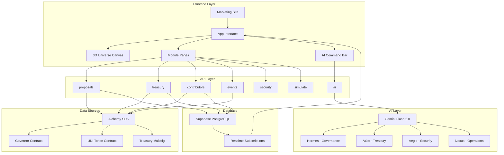
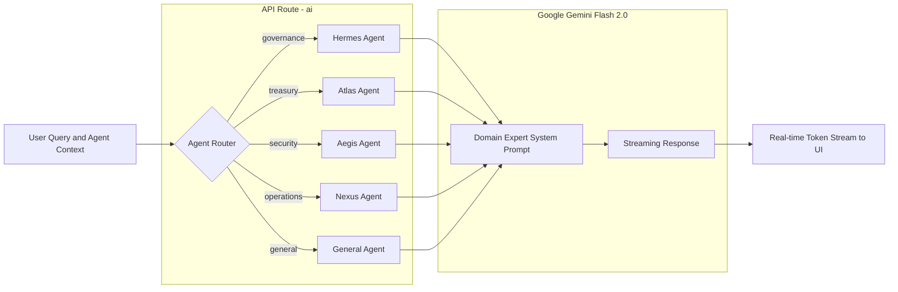
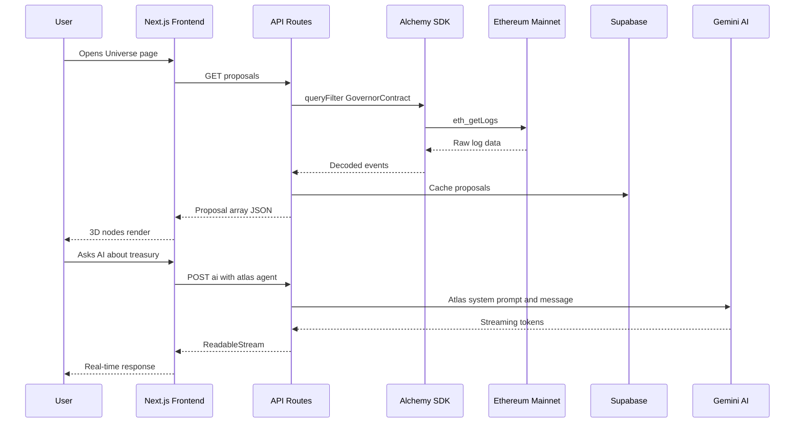
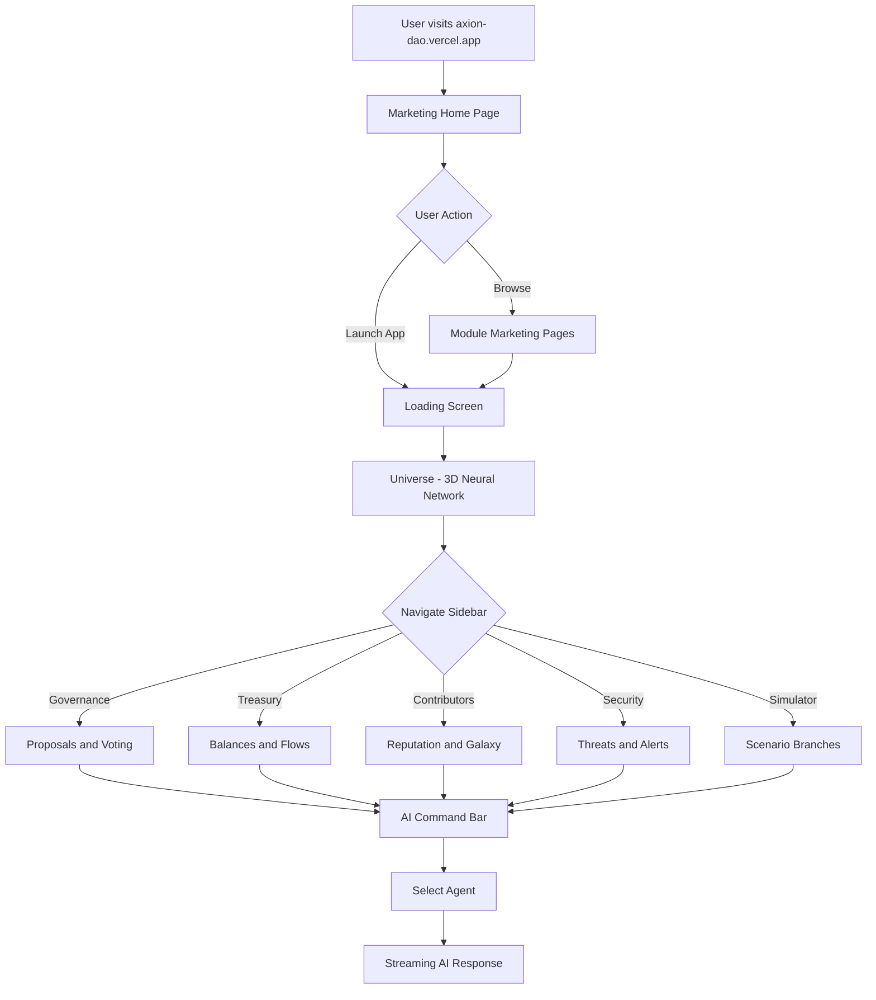

# AXION — DAO Cosmos OS

### Mission Control for Decentralized Organizations

[](https://nextjs.org)
[](https://www.typescriptlang.org)
[](https://threejs.org)
[](https://ai.google.dev)
[](https://ethereum.org)
[](https://alchemy.com)
[](https://supabase.com)
[](LICENSE)
[](https://innovat3.dev)

Axion is a real-time 3D intelligence platform for decentralized autonomous organizations. It renders your entire DAO — governance proposals, treasury flows, contributor networks, and security threats — as a living neural network in 3D space, powered by four specialized AI agents that run 24/7 on Google Gemini Flash 2.0.

**Live Demo:** [https://axion-dao.vercel.app](https://axion-dao.vercel.app)


---

## The Problem

Decentralized governance is broken — not because DAOs lack participation, but because they lack **visibility**. Uniswap's 40M UNI quorum threshold has been reached in fewer than 15% of proposals in its history. Compound's governance forum is filled with proposals that passed with less than 1% voter participation. MakerDAO has faced repeated governance attacks where coordinated whale clusters passed contentious risk parameter changes without broad community awareness. The infrastructure for decentralized decision-making exists; the intelligence layer to make sense of it does not.

Treasury movements are effectively invisible until it's catastrophically too late. The Uniswap DAO holds over $2.3 billion in assets, yet there is no real-time dashboard that shows token flows, runway projections, and anomaly detection in a single view. Finance teams at centralized companies have Bloomberg terminals and live P&L dashboards. DAO treasuries — managing billions in community funds — are monitored via manual Etherscan refreshes and Discord alerts from volunteers.

Security threats in governance are systematic and well-documented, yet no tool actively monitors for them. Sybil attack clusters — wallets with identical funding sources and synchronized voting patterns — have influenced outcomes in multiple DAOs. Flash loan governance attacks (most famously the $182M Beanstalk exploit) exploit the gap between execution speed and human response time. Governance manipulation through coordinated delegate capture is slow-moving and hard to detect. None of these threats have real-time automated detection today.

Contributors burn out silently and invisibly. The people building the most valuable DAOs have no feedback loop — no XP system, no reputation score, no visualization of their impact on the network. They cannot see how their votes shaped outcomes, how their proposals spread through the contributor graph, or where they stand in the community. Contribution without visibility is contribution without meaning.

No single platform gives DAOs real-time, cross-dimensional intelligence. Teams use Snapshot for voting, Etherscan for treasury, Dune Analytics for historical data, Discord for community, and Tenderly for contract monitoring — five separate tools with no shared context, no AI synthesis, and no unified view of DAO health. Axion was built to close this gap entirely.

---

## The Solution

Axion gives DAO operators, delegates, and community members a single command center with complete, real-time intelligence across every dimension:

**3D Universe** — Your entire DAO is rendered as a living neural network. The central Earth globe represents the protocol core. Six satellite nodes orbit it: Governance Arena, Treasury Reactor, Contributor Galaxy, Security Sentinel, Multiverse Simulator, and AI Agents. Particles travel between nodes representing live events — a vote cast, a treasury transfer, a threat detected. The universe breathes with your DAO's activity in real time.

**Four AI Agents** — HERMES (governance), ATLAS (treasury), AEGIS (security), and NEXUS (operations) are purpose-trained domain experts powered by Gemini 2.0 Flash. They respond in natural language to any question about your DAO, streaming answers token-by-token. Ask HERMES "who are the whale voters on the current fee switch proposal?" or ask ATLAS "is our runway healthy given the recent UNI price drop?" and receive a structured, data-grounded answer in seconds.

**Live Blockchain Data** — All seven API routes connect to Ethereum mainnet via the Alchemy SDK, targeting the Uniswap Governor Bravo contract (`0x408ED6354d4973f66138C91495F2f2FCbd8724C3`) and UNI token (`0x1f9840a85d5aF5bf1D1762F925BDADdC4201F984`). Proposals, vote records, token balances, treasury transfers, and on-chain events are fetched, decoded, and served through a typed REST API with graceful mock fallback for offline/demo use.

**Threat Detection** — The Security Sentinel module runs continuous heuristic analysis across six threat categories: Sybil clusters, treasury drain patterns, governance manipulation, suspicious wallet behavior, flash loan risk, and contract exploits. Each threat includes evidence, risk score, affected entity, and AI-generated remediation recommendations.

**Multiverse Simulator** — Input any governance scenario (market crash, governance takeover, treasury depletion, whale influence, contributor exodus, protocol exploit) and receive three branching timeline forecasts with probability scores, sentiment labels, survival runway projections, and narrative analysis.

**Built for Scale** — Axion is architected for any Governor Bravo DAO. The `DAO_CONFIG` in `src/lib/constants.ts` is the single source of truth for contract addresses, quorum thresholds, and whale definitions. Swap in any DAO's config and the entire platform reconfigures.

---

## Features

| Feature | Description |
|---|---|
| **3D Universe Canvas** | Real-time Three.js neural network with Earth core, 6 satellite module nodes, orbital connection lines, and traveling particles |
| **Governance Arena** | Live proposal list, FOR/AGAINST/ABSTAIN vote bars, whale voter tracking, quorum progress indicator, AI-generated proposal summaries |
| **Treasury Reactor** | Multi-token balance display for the $2.3B Uniswap treasury, 24h and 7d flow tracking, runway calculator, health score, anomaly flags |
| **Contributor Galaxy** | Contributor profiles with reputation scores, XP levels, contributor classes (Architect, Diplomat, Sentinel, Merchant, Explorer), and activity charts |
| **Security Sentinel** | Active threat list with severity badges, threat type classification (Sybil, flash loan, treasury drain, contract exploit), and evidence viewer |
| **Multiverse Simulator** | 7 scenario types, 3 branching timelines per run, probability scores, treasury impact projections, and survival runway in months |
| **AI Agent Terminal** | HERMES, ATLAS, AEGIS, and NEXUS agents powered by Gemini 2.0 Flash with streaming responses and agent-selector chips |
| **Live Event Ticker** | Scrolling marquee of real-time DAO events in the status bar |
| **Loading Screen** | Animated system initialization sequence with per-module boot messages |
| **Status Bar** | Live Ethereum block number, UTC clock, DAO health score, and wallet address display |
| **Sidebar Navigation** | Collapsible module sidebar with active state highlighting and smooth transitions |
| **Marketing Site** | 9-section landing page with MetaMask design system, Framer Motion scroll animations, and count-up stats |

---

## System Architecture



**Frontend Layer** — A Next.js 14 App Router application with two distinct zones: a MetaMask-inspired marketing site at `/` with 9 animated sections, and a full-screen 3D OS at `/app`. The app zone renders a fixed Three.js canvas as the base layer (z=0) with a transparent 2D UI layer (z=10+) containing the sidebar, status bar, and module pages. Framer Motion drives all scroll and mount animations.

**API Layer** — Seven Next.js API route handlers with `force-dynamic` cache headers. All routes are typed end-to-end using TypeScript interfaces from `src/lib/types.ts`. Routes return mock data from `src/lib/mockData.ts` as a graceful fallback when no API keys are present, making the full platform demonstrable without any external dependencies.

**Blockchain Integration Layer** — The Alchemy SDK is configured for Ethereum mainnet, targeting three core Uniswap contracts. The Governor Bravo contract (`0x408ED6354d4973f66138C91495F2f2FCbd8724C3`) is the source for all governance data. The UNI token contract (`0x1f9840a85d5aF5bf1D1762F925BDADdC4201F984`) provides voting power and delegation data. The Treasury multisig (`0x1a9C8182C09F50C8318d769245beA52c32BE35BC`) holds $2.3B in UNI, USDC, and ETH.

**AI Agent Layer** — A single Edge Runtime route (`/api/ai`) dispatches to one of five Gemini system prompts based on the `agent` key in the request body. Each agent is a domain expert with a specialized system instruction. Responses are streamed token-by-token via `ReadableStream` and decoded incrementally in the UI. A graceful demo-mode fallback fires when `GOOGLE_GENERATIVE_AI_API_KEY` is absent.

**Database and Real-time Layer** — Supabase PostgreSQL stores 7 tables: `proposals`, `votes`, `contributors`, `treasury_snapshots`, `treasury_transfers`, `threats`, and `events`. Realtime publication is enabled on four high-frequency tables (`events`, `threats`, `votes`, `treasury_transfers`) for live UI updates. Composite indexes are defined on all hot query paths.

---

## AI Agents Architecture



| Agent | Code Name | Domain | Specialization | Example Queries |
|---|---|---|---|---|
| HERMES | `governance` | Governance | On-chain proposals, voting patterns, quorum risk, delegate alignment, whale tracking | "Who are the whale voters on Prop #127?", "What's the quorum risk this week?" |
| ATLAS | `treasury` | Treasury | Multi-token balances, token flow analysis, runway projections, outflow anomaly detection | "Is our runway healthy?", "Show me anomalous outflows in the last 24h" |
| AEGIS | `security` | Security | Sybil cluster analysis, governance attack simulation, flash loan risk scoring, wallet behavior patterns | "Any sybil activity today?", "Alert me on flash loan governance risk" |
| NEXUS | `operations` | Operations | Contributor reputation scoring, collaboration network analysis, scenario forecasting | "Model a 40% market crash", "Simulate a governance takeover scenario" |

---

## Data Flow Architecture



---

## User Flow



---

## Technical Stack

| Category | Technology | Version | Purpose |
|---|---|---|---|
| **Framework** | Next.js | 14.2.15 | App Router, API routes, SSG/SSR |
| **Language** | TypeScript | 5.6.3 | Full type safety, interfaces for all data models |
| **3D Rendering** | Three.js | r169 | WebGL scene, geometry, materials, lighting |
| **3D Framework** | React Three Fiber | 8.17.10 | Declarative Three.js in React |
| **3D Helpers** | React Three Drei | 9.114.3 | Stars, OrbitControls, Text, Html annotations |
| **Post-processing** | @react-three/postprocessing | 2.16.3 | Bloom, depth-of-field, chromatic aberration |
| **Animation** | Framer Motion | 11.11.0 | Scroll animations, mount/unmount transitions |
| **State Management** | Zustand | 5.0.0 | Global store for DAO data, UI state, AI agents |
| **Blockchain** | Alchemy SDK | 3.4.1 | Ethereum mainnet data, event log queries |
| **Blockchain** | Ethers.js | 6.13.4 | Contract ABI decoding, ENS resolution |
| **AI** | @google/generative-ai | 0.24.1 | Gemini 2.0 Flash, streaming content generation |
| **Database** | Supabase | 2.46.1 | PostgreSQL and realtime subscriptions |
| **Charts** | Recharts | 2.13.3 | Treasury and governance data visualization |
| **Data Viz** | D3 | 7.9.0 | Custom network graph layouts |
| **Icons** | Lucide React | 0.577.0 | UI icon set |
| **Styling** | Tailwind CSS | 3.4.14 | Utility classes |
| **Styling** | CSS Custom Properties | — | MetaMask design token system |
| **Date Utils** | date-fns | 4.1.0 | Timestamp formatting |
| **Deployment** | Vercel | — | Edge runtime, CDN, automatic HTTPS |

---

## Project Structure

```
dao-cosmos-os/
├── src/
│   ├── app/
│   │   ├── page.tsx                    # Marketing home - 9-section landing page
│   │   ├── layout.tsx                  # Root layout with MarketingNav
│   │   ├── globals.css                 # MetaMask design system, mm-btn, display-hero
│   │   ├── providers.tsx               # Zustand store hydration, Supabase client
│   │   ├── ai-agents/page.tsx          # AI Agents marketing page with live terminal
│   │   ├── governance/page.tsx         # Governance marketing page
│   │   ├── treasury/page.tsx           # Treasury marketing page
│   │   ├── security/page.tsx           # Security marketing page
│   │   ├── platform/page.tsx           # Platform overview
│   │   ├── universe/page.tsx           # Universe marketing page
│   │   ├── docs/page.tsx               # Documentation page
│   │   ├── app/                        # App OS Zone
│   │   │   ├── layout.tsx              # App shell: 3D canvas, sidebar, status bar
│   │   │   ├── page.tsx                # Universe module - module quick-access grid
│   │   │   ├── governance/page.tsx     # Governance Arena: proposals, votes, KPIs
│   │   │   ├── treasury/page.tsx       # Treasury Reactor: balances, flows, health
│   │   │   ├── contributors/page.tsx   # Contributor Galaxy: profiles, XP, leaderboard
│   │   │   ├── security/page.tsx       # Security Sentinel: threats, scores, evidence
│   │   │   └── simulator/page.tsx      # Multiverse Simulator: scenarios, timelines
│   │   └── api/
│   │       ├── ai/route.ts             # POST - Gemini 2.0 Flash streaming, 5-agent dispatch
│   │       ├── blockchain/
│   │       │   ├── proposals/route.ts  # GET - Uniswap Governor proposals
│   │       │   ├── treasury/route.ts   # GET - Treasury balances and transfers
│   │       │   ├── contributors/route.ts # GET - Contributor reputation and XP
│   │       │   └── events/route.ts     # GET - Live DAO event stream
│   │       ├── security/route.ts       # GET - Active threats and wallet scores
│   │       └── simulate/route.ts       # POST - Scenario simulation (3 timelines)
│   ├── components/
│   │   ├── canvas/
│   │   │   ├── UniverseCanvas.tsx      # Dynamic import wrapper (SSR disabled)
│   │   │   ├── UniverseScene.tsx       # Full Three.js scene: globe, nodes, particles
│   │   │   └── ...                     # NodeSphere, EnergyStream, StarField, etc.
│   │   ├── ui/
│   │   │   ├── StatusBar.tsx           # Fixed top bar: block, clock, health, wallet
│   │   │   ├── Sidebar.tsx             # Collapsible module navigation
│   │   │   └── LoadingScreen.tsx       # Boot sequence loading animation
│   │   └── marketing/
│   │       └── MarketingNav.tsx        # Full-width sticky nav, dark section detection
│   ├── hooks/
│   │   ├── useAIChat.ts                # Streaming AI chat with agent context
│   │   ├── useApiData.ts               # Generic data fetcher with loading/error state
│   │   └── useCountUp.ts               # Animated number count-up on mount
│   ├── services/
│   │   ├── alchemy.ts                  # Alchemy SDK client, contract event queries
│   │   ├── contracts.ts                # Governor and Token ABI definitions
│   │   ├── security.ts                 # Threat heuristics, wallet risk scoring
│   │   ├── simulator.ts                # Monte Carlo scenario simulation engine
│   │   └── supabase.ts                 # Supabase client, CRUD and realtime helpers
│   ├── store/
│   │   ├── daoStore.ts                 # DAO data: proposals, treasury, contributors
│   │   ├── agentStore.ts               # AI agent messages, streaming state
│   │   ├── eventStore.ts               # Real-time event queue, visual effects
│   │   └── uiStore.ts                  # Active module, sidebar, camera, demo mode
│   └── lib/
│       ├── types.ts                    # All TypeScript interfaces (25+ types)
│       ├── constants.ts                # DAO config (Governor address, quorum, modules)
│       ├── mockData.ts                 # Realistic Uniswap mock data for demo/fallback
│       ├── api.ts                      # Centralized API client (fetch wrappers)
│       └── formatters.ts               # formatCurrency, formatNumber, formatPercent
├── supabase/
│   └── migrations/
│       └── 001_initial.sql             # Full DB schema: 7 tables, realtime setup
├── public/
│   └── fonts/                          # Orbitron, Rajdhani, JetBrains Mono
├── next.config.js                      # Security headers, GLSL loader, Three.js SSR fix
├── .env.example                        # Environment variable template
└── package.json                        # Dependencies and scripts
```

---

## How to Run Locally

### Prerequisites

- **Node.js 18+** — check with `node --version`
- **npm** — comes with Node.js
- **Git**

### Step 1 — Clone the repository

```bash
git clone https://github.com/advikdivekar/axion-innovat3-hackathon.git
cd axion-innovat3-hackathon
```

### Step 2 — Install dependencies

```bash
npm install
```

### Step 3 — Environment Variables

```bash
cp .env.example .env.local
```

Open `.env.local` and fill in your keys:

```env
# Blockchain Data (mock data used without this)
ALCHEMY_API_KEY=your_alchemy_api_key_here
ALCHEMY_NETWORK=eth-mainnet

# AI Agents (demo mode without this)
GOOGLE_GENERATIVE_AI_API_KEY=your_gemini_api_key_here

# Database (optional for demo)
NEXT_PUBLIC_SUPABASE_URL=your_supabase_url_here
NEXT_PUBLIC_SUPABASE_ANON_KEY=your_supabase_anon_key_here
SUPABASE_SERVICE_ROLE_KEY=your_supabase_service_role_key_here

# App Config
NEXT_PUBLIC_TARGET_DAO=uniswap
NEXT_PUBLIC_APP_URL=http://localhost:3001
```

> **Note:** The app runs fully without any API keys using realistic mock Uniswap data. All 21 pages build and render.

### Step 4 — Run the development server

```bash
npm run dev -- --port 3001
```

Open [http://localhost:3001](http://localhost:3001)

### Step 5 — Verify the API endpoints

```bash
curl http://localhost:3001/api/blockchain/proposals
curl http://localhost:3001/api/blockchain/treasury
curl http://localhost:3001/api/blockchain/contributors
curl http://localhost:3001/api/security

curl -X POST http://localhost:3001/api/simulate \
  -H "Content-Type: application/json" \
  -d '{"scenarioType":"market_crash","severity":0.7}'
```

---

## Deploying to Vercel

### Option A — Vercel CLI

```bash
npm install -g vercel
vercel login
vercel --prod
```

### Option B — Vercel Dashboard

1. Go to [vercel.com](https://vercel.com) → New Project
2. Import your GitHub repository
3. Framework: **Next.js** (auto-detected)
4. Click **Deploy**

### Environment Variables

Add these in Vercel Dashboard under Project → Settings → Environment Variables:

```
ALCHEMY_API_KEY
GOOGLE_GENERATIVE_AI_API_KEY
NEXT_PUBLIC_SUPABASE_URL
NEXT_PUBLIC_SUPABASE_ANON_KEY
SUPABASE_SERVICE_ROLE_KEY
NEXT_PUBLIC_TARGET_DAO=uniswap
NEXT_PUBLIC_APP_URL=https://axion-dao.vercel.app
```

---

## API Reference

All routes return `application/json`. The AI route returns `text/plain; charset=utf-8` as a streaming response.

### `GET /api/blockchain/proposals`

```json
[
  {
    "id": "127",
    "title": "Upgrade fee switch to 1/5 protocol fee",
    "status": "active",
    "forVotes": 12400000,
    "againstVotes": 6000000,
    "quorum": 40000000,
    "quorumReached": false,
    "impactScore": 85,
    "topVoters": [{ "voterENS": "a16z.eth", "weight": 2100000, "isWhale": true }]
  }
]
```

### `GET /api/blockchain/treasury`

```json
{
  "totalValueUSD": 2341567890,
  "tokens": [
    { "symbol": "UNI", "valueUSD": 1800000000, "percentage": 76.8 },
    { "symbol": "USDC", "valueUSD": 340000000, "percentage": 14.5 },
    { "symbol": "ETH", "valueUSD": 180000000, "percentage": 7.7 }
  ],
  "runwayDays": 1533,
  "healthScore": 87,
  "riskLevel": "normal"
}
```

### `GET /api/blockchain/contributors`

```json
[
  {
    "ensName": "vitalik.eth",
    "votingPower": 2800000,
    "reputationScore": 94,
    "contributorClass": "architect",
    "xp": 48200,
    "level": 34
  }
]
```

### `GET /api/security`

```json
[
  {
    "type": "sybil",
    "severity": "critical",
    "riskScore": 87,
    "title": "Sybil Attack Detected",
    "status": "active",
    "detectedBy": "ai"
  }
]
```

### `POST /api/simulate`

**Request:** `{ "scenarioType": "market_crash", "severity": 0.7 }`

**Scenario types:** `market_crash` · `governance_takeover` · `treasury_depletion` · `whale_influence` · `contributor_exodus` · `protocol_exploit` · `custom`

Returns 3 `SimulationTimeline` objects (Resilient / Stagnant / Collapse) with probability, treasury impact %, and survival runway in months.

### `POST /api/ai`

**Request:** `{ "message": "Is our treasury healthy?", "agent": "treasury" }`

**Agent values:** `governance` (HERMES) · `treasury` (ATLAS) · `security` (AEGIS) · `operations` (NEXUS) · `general`

**Response:** `text/plain` streaming — tokens arrive incrementally via `ReadableStream`.

---

## Contributing

1. Fork the repository
2. Create a feature branch: `git checkout -b feat/your-feature`
3. Commit: `git commit -m "feat: describe your change"`
4. Push and open a Pull Request against `dev`

**Branch convention:** `main` → production · `dev` → integration · `Dev-A` / `Dev-B` → feature branches

---

## License

MIT License — see [LICENSE](LICENSE) for details.

---

## Built with ❤️ for INNOVAT3

**Axion** was designed and built for the **INNOVAT3 Hackathon** as a demonstration of what AI-powered DAO tooling can look like when visual design, real-time blockchain data, and large language models are unified into a single platform.

> *Every DAO deserves a Bloomberg Terminal — real-time, intelligent, beautiful. Axion is that terminal.*

**Author:** Advik Divekar · **Hackathon:** INNOVAT3 · **Target DAO:** Uniswap (Governor Bravo · 40M UNI quorum · $2.3B treasury)
